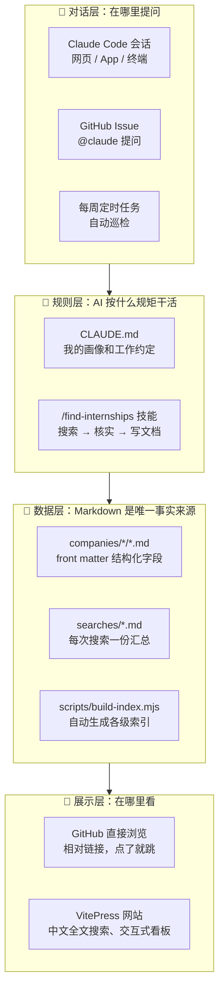
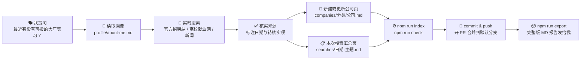

# ⚙️ 系统说明：这个仓库是怎么运转的

[← 返回首页](../README.md)

> 这个仓库本身就是 Slogan 2️⃣ 的实践：用大白话和 AI 对话，把「找实习」这件事做成一套能持续运转的系统。

---

## 1. 架构总览



| 层 | 技术选型 | 为什么这样选 |
| --- | --- | --- |
| 对话层 | **Claude Code**（会话）、**claude-code-action**（Issue 里 @claude、定时任务） | 一套规则，三个入口。手机上开 Issue 也能提问 |
| 规则层 | `CLAUDE.md` + 项目技能 `.claude/skills/find-internships` | 把「我是谁」「怎么搜」「怎么写」固化下来，每次搜索的质量都稳定 |
| 数据层 | **Markdown + YAML front matter** | 人能直接读，机器也能解析。看板和索引都从 front matter 自动生成，不会出现「两处不一致」 |
| 展示层 | **GitHub 原生渲染** + **VitePress 1.x**（GitHub Pages 部署） | GitHub 上点链接就能看。网站提供**中文全文搜索**（汉字二元组分词）、**可筛选的实习看板**、公司信息卡、深色模式 |
| 质量 | `npm run check`（front matter 校验、必备章节、🔴 是否写了下次关注、断链检查、索引是否最新）+ GitHub Actions CI | AI 写错字段、漏写章节、链接写断时，CI 会立刻报警 |

## 2. 一次提问的完整流程



## 3. 目录结构

```
.
├── README.md                    首页（GitHub 和网站共用）
├── board.md                     交互式实习看板（网站专用）
├── CLAUDE.md                    给 AI 的工作约定
├── profile/                     关于我、我的 Slogan
├── searches/                    每次搜索一份汇总（YYYY-MM-DD-主题.md）
├── companies/
│   ├── ai-tech/                 AI / 科技大厂
│   ├── soe/                     传统行业央国企
│   └── foreign/                 外企 / 跨国企业
├── guides/                      招聘日历、已过期待投递清单、投递追踪表、系统说明
├── templates/                   公司页、搜索页模板
├── scripts/                     build-index.mjs（生成索引）、check.mjs（自检）、export-search.mjs（导出完整版报告）
├── exports/                     每次回复的 MD 交付文档、导出的完整版报告（不进仓库，每次发给我）
├── .vitepress/                  网站配置、主题、看板组件
├── .claude/skills/              find-internships 技能
└── .github/                     CI、网站部署、@claude 问答、每周巡检
```

## 4. 怎么用

### 方式 A：Claude Code 会话（最推荐）

1. 打开 [claude.ai/code](https://claude.ai/code)，选中这个仓库，开一个新会话
2. 用大白话提问，或者输入 `/find-internships`
3. AI 会搜索、写文档、自检，然后 push
4. 最后 AI 会把这次搜索的**完整版 MD 报告**直接发给你。报告由 `npm run export` 生成，把搜索汇总和所有相关公司详情合并成一个文件，可以单独阅读、转发或打印

### 方式 B：GitHub Issue 里 @claude（需要一次性配置，见下）

1. [新建 Issue](https://github.com/1739467001-svg/Internship-Application/issues/new/choose)，选「🔎 实习搜索请求」模板
2. 写下问题，提交即可。AI 会在 Issue 里回复，并开一个 PR 提交新文档

### 方式 C：每周自动巡检（需要一次性配置，见下）

- 每周一自动复查公司库里所有公司的状态，有变化就开一个 PR

## 5. 一次性配置

| 功能 | 怎么开启 |
| --- | --- |
| **网站（GitHub Pages）** | 仓库 Settings → Pages → Source 选「**GitHub Actions**」。之后每次 push 到默认分支都会自动部署到 `https://1739467001-svg.github.io/Internship-Application/` |
| **Issue 里 @claude** | 在本地终端运行 `claude`，再输入 `/install-github-app`，按提示安装 Claude GitHub App 并配置密钥（`ANTHROPIC_API_KEY` 或 `CLAUDE_CODE_OAUTH_TOKEN`）。密钥不要写进仓库 |
| **每周自动巡检** | 和上一条用同一个密钥。没有配置密钥时，这个工作流会自动跳过，不会报错 |

### 本地预览网站

```bash
npm install
npm run dev        # 本地预览 http://localhost:5173/Internship-Application/
npm run index      # 根据 front matter 重新生成索引
npm run check      # 自检：字段、断链、索引是否最新
npm run build      # 构建静态网站
npm run export     # 把最新一次搜索导出成一份完整的 MD 报告（exports/，不进仓库）
```

## 6. 后续可以升级的方向

| 阶段 | 内容 | 状态 |
| --- | --- | --- |
| v1 | Markdown 知识库 + CLAUDE.md + 技能 | ✅ |
| v2 | VitePress 网站 + 中文搜索 + 交互式看板 + CI | ✅ |
| v3 | Issue 问答 + 每周自动巡检 | ✅ 已就绪，需要配置密钥 |
| v4 | 截止日期提醒：看板上加「7 天内截止」高亮，或者发邮件提醒 | 计划中 |
| v5 | 简历按岗位定制：根据公司页的岗位要求，自动生成针对性的简历和求职信 | 计划中 |

> v5 对应 Slogan 5️⃣：搭配不同的 AI 工具，各做自己最擅长的那一环。
