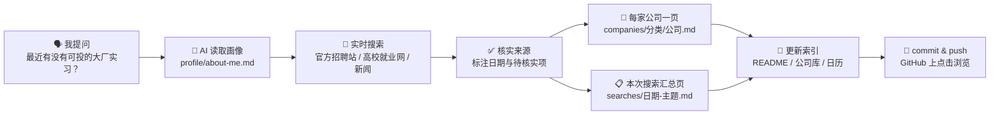

# 系统说明：这个仓库是怎么运转的

[← 返回首页](../README.md)

> 这个仓库本身就是 Slogan 2️⃣ 的实践：用大白话和 AI 对话，把「找实习」这件事做成一套能持续运转的系统。

---

## 1. 设计思路

| 层 | 是什么 | 对应文件 |
| --- | --- | --- |
| **对话层** | 我用大白话在 Claude Code（网页版、App 或终端都行）里提问 | 对话本身 |
| **规则层** | 告诉 AI 这个仓库怎么用：我是谁、该怎么搜、文档怎么写 | [`CLAUDE.md`](../CLAUDE.md)、[`/find-internships` 技能](../.claude/skills/find-internships/SKILL.md) |
| **数据层** | 所有搜索结果都沉淀成 Markdown，放在 GitHub 上随时能看 | [`searches/`](../searches/README.md)、[`companies/`](../companies/README.md) |
| **行动层** | 把信息变成行动：什么时候投、投了没、进展到哪一步 | [招聘日历](recruitment-calendar.md)、[投递追踪表](application-tracker.md) |

## 2. 一次提问的完整流程



## 3. 浏览路径（GitHub 上怎么看）

```
README.md（首页）
 ├── 最新搜索 → searches/2026-10-06-首次全面搜索.md（汇总表）
 │                 └── 点「查看 →」→ companies/soe/state-grid.md（详情页）
 ├── 公司库   → companies/README.md → 各公司详情页
 ├── 关于我   → profile/about-me.md
 └── Slogan   → profile/slogan.md → 链接到相关公司页
```

## 4. 怎么用（日常操作）

1. 打开 [claude.ai/code](https://claude.ai/code)，选中这个仓库，开一个新会话
2. 用大白话提问，例如：
   - 「最近有没有可以投递的大厂实习？」
   - 「帮我看看四川有哪些水电企业在招 AI 相关的人」
   - 「更新一下西门子和施耐德的实习信息」
   - 「国家电网第一批招聘公告出来没有？」
   - 也可以直接输入 `/find-internships`
3. AI 会自动搜索，生成或更新 MD 文档，再 push 到 GitHub
4. 在 GitHub 上从 [README](../README.md) 开始点着浏览。看中的岗位记到 [投递追踪表](application-tracker.md)

## 5. 后续可以升级的方向

| 阶段 | 升级内容 | 难度 |
| --- | --- | --- |
| v1（当前） | 纯 Markdown 文档，GitHub 上直接浏览 | ✅ 已完成 |
| v2 | 用 GitHub Pages + MkDocs / Docsify，把仓库变成一个带搜索框的网站 | ⭐⭐ |
| v3 | 定时任务：每周自动搜一次，有新岗位就自动生成搜索页 | ⭐⭐ |
| v4 | 给每个公司页加上 YAML 元数据（状态、截止日期、匹配度），自动生成「即将截止」提醒 | ⭐⭐⭐ |
| v5 | 简历按岗位定制：根据公司页的岗位要求，自动生成一版针对性的简历和求职信 | ⭐⭐⭐ |

> v5 和 Slogan 5️⃣ 正好对得上：搭配不同的 AI 工具，各做自己最擅长的那一环。
